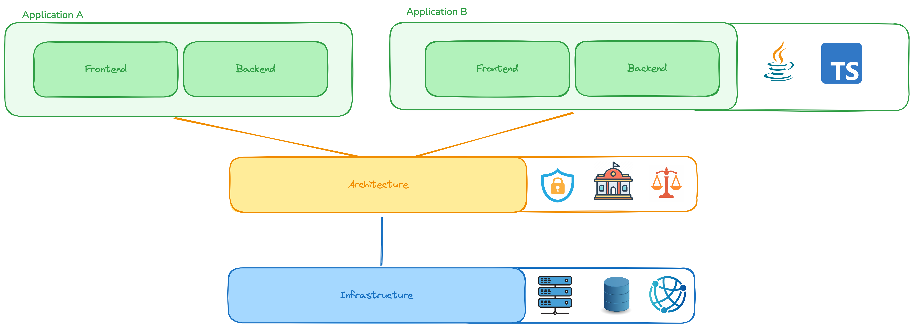

# Fractal-First Sample

* Focus on reusability and automation across your organization
* Advised on establishing a cloud adoption and governance framework at the enterprise level

This PoC demonstrate the simplicity of using Fractal Architecture through Fractal Cloud, resolving the following pains:

* Remove the need of deep infrastructure knowledge within the development teams
* Reuse of templates and best practices for multiple teams and projects
* Reuse of templates and best practices across multiple cloud vendors
* Remove manual work from the Cloud Centers of Excellence, automating deployment of standard and secure infrastructure

## Getting Started

In the [Infrastructure](./infrastructure) project, Infrastructure
specialists work with creating reusable components for the Application teams.

As you can see from the image above and the code in that repo, there is no requirement of knowing
Cloud Provider's inner workings, and they can instead use general infrastructure knowledge to create reusable
templates and components, we call `Fractals`.

In the [Architecture](./architecture) project, specialists within security and governance decides which Fractal to use using
their knowledge of industry regulation, security requirements, and so on. They can also maintain a continuously
up to date overview of the IT Landscape.

They do not depend directly on the Infrastructure Teams, as they can work reusing automatically the Fractals already
available. Only in the case something is not there, they can collaborate on the creation of a new standard Fractal

In the Application layer projects, namely [Frontend](./frontend) and [Backend](./backend), application developer can just work without
having to even thinking about all this complexity. Fractal cloud takes care of deploying their application in the
correct LiveSystem.

#### [Go back to previous README](../README.md)